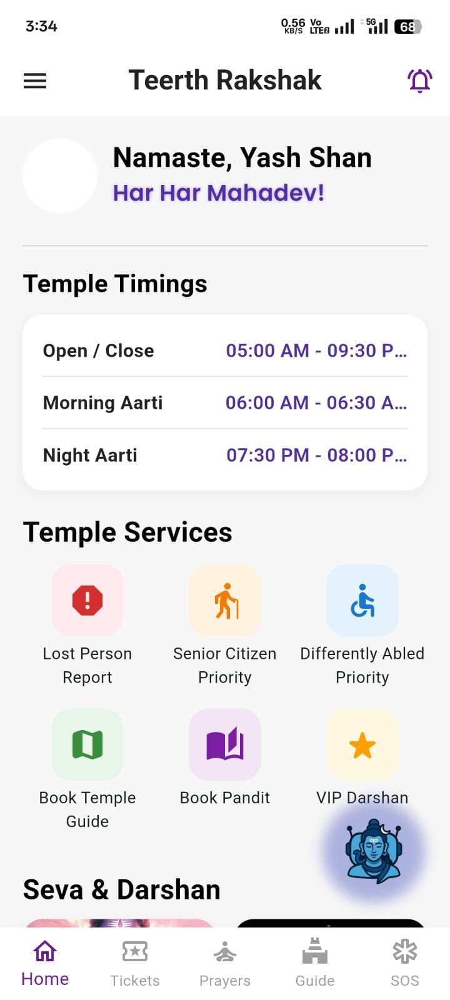
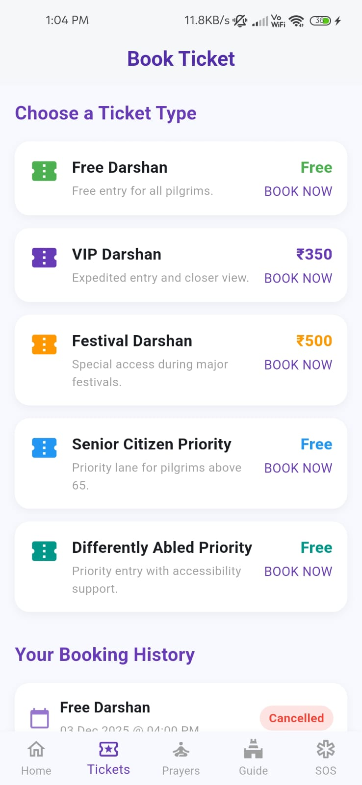
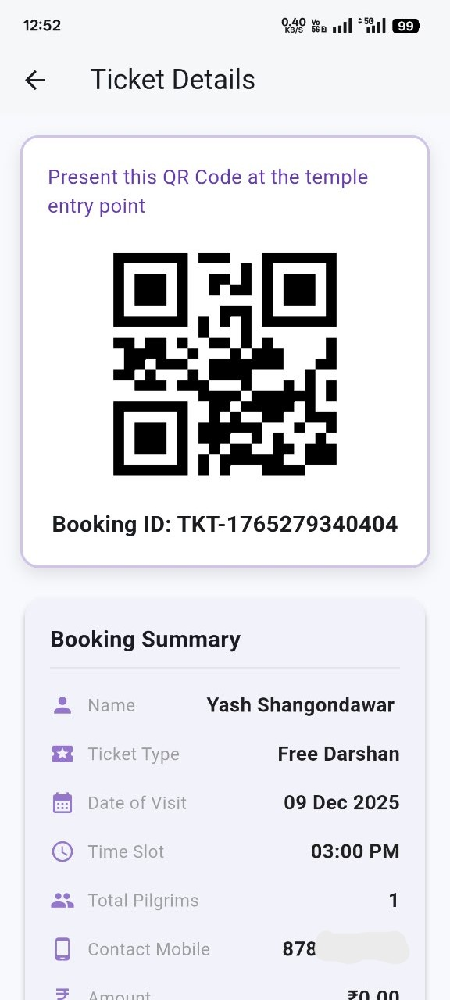
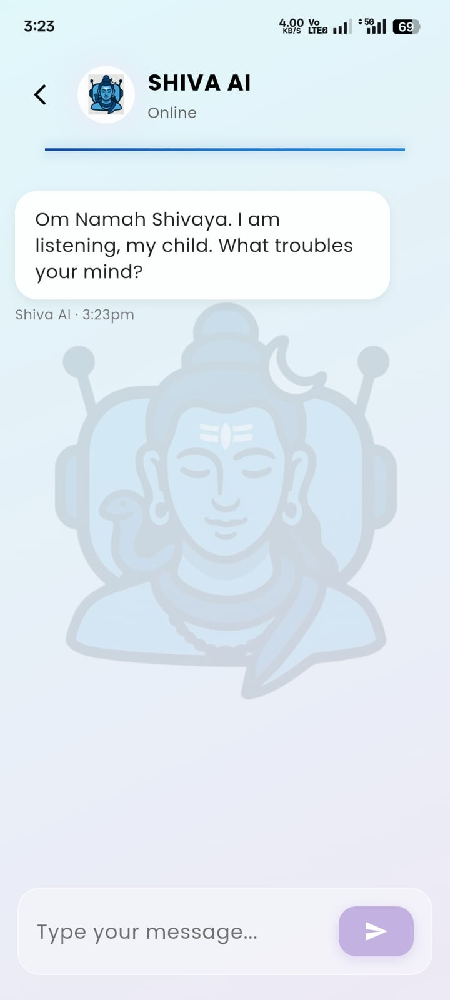
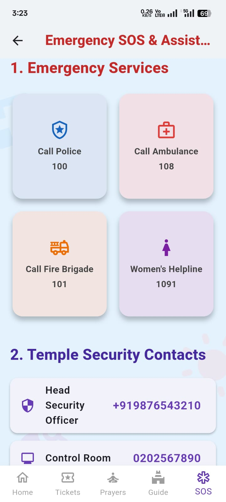
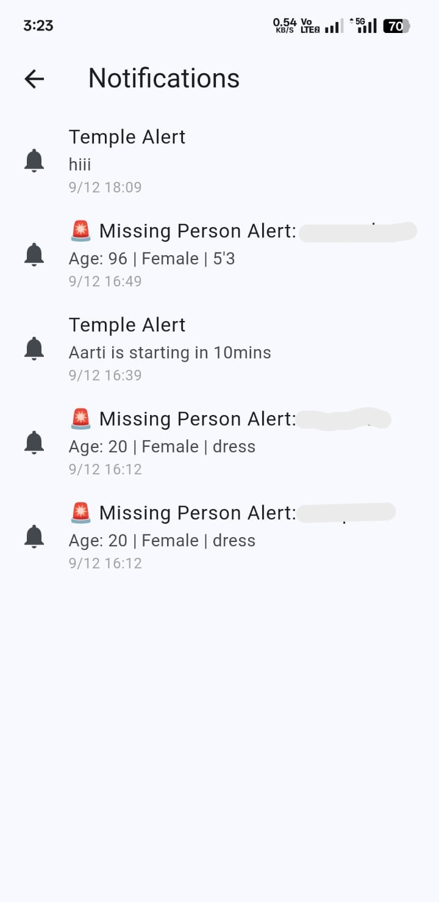
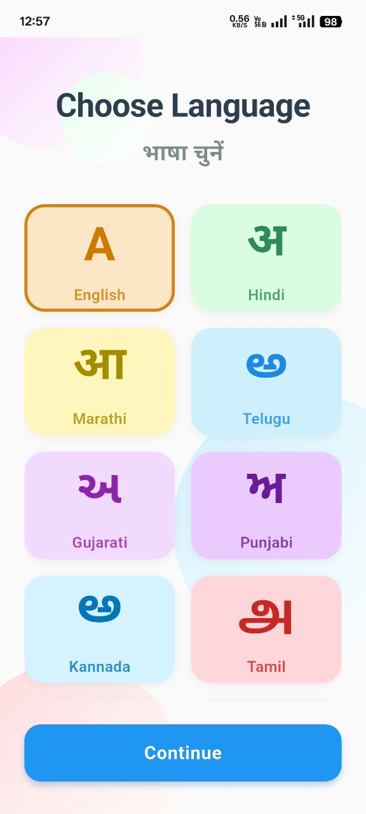
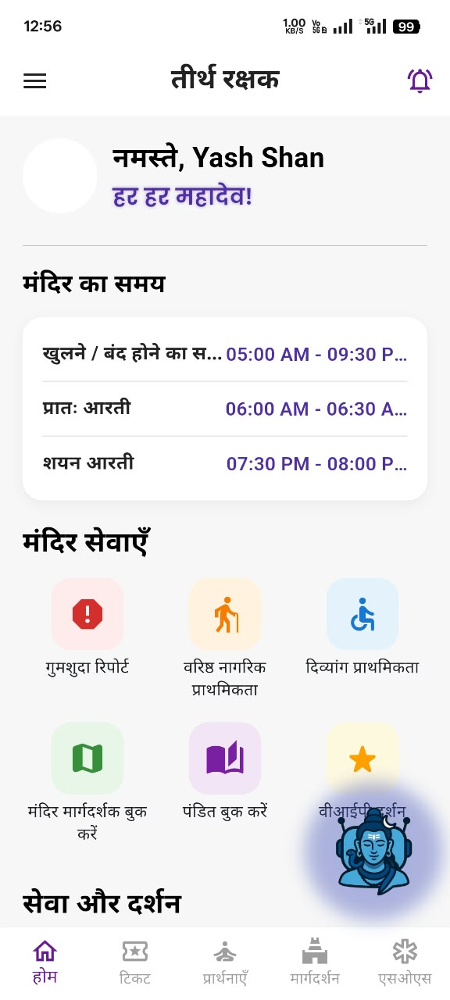

# 🛕 Teerth-Rakshak — Smart Pilgrimage Management App

> 🏆 Smart India Hackathon 2025 Winning Solution

## 🎯 Problem

Large-scale pilgrimages can create challenges such as overcrowding,
long waiting times, lost-person situations, difficulty accessing
essential services, and limited access to timely information.

## 💡 Solution

Teerth-Rakshak is a Flutter-based mobile application that provides
pilgrims with digital darshan booking, safety assistance,
lost-person reporting, real-time notifications, multilingual support,
and an AI-powered assistant through a single platform.

## 🛠️ Tech Stack

**Flutter • Dart • Firebase • Cloud Firestore • Firebase Storage • Google Gemini API**

## ✨ Key Features

- 🎟️ Smart Darshan Ticket Booking
- 🚨 Lost Person Reporting
- 🆘 Emergency SOS & Assistance
- 🤖 Shiva AI Assistant
- 🔔 Real-Time Notifications
- 🌐 Multilingual Support
- 🛕 Temple Services & Information
- ♿ Senior Citizen & Differently Abled Priority

## 📱 App Screenshots

### 🏠 Home & Ticket Booking

### 🎫 Digital Ticket & AI Assistant

### 🆘 Safety & Notifications

### 🌐 Multilingual Support

---
## 🔗 Complete Project

For the complete Teerth-Rakshak solution, including the AI-powered
Crowd Monitoring Dashboard and detailed system documentation:

[View Complete Teerth-Rakshak Showcase →](https://github.com/yash-shangondawar/Teerth-Rakshak-Showcase)
